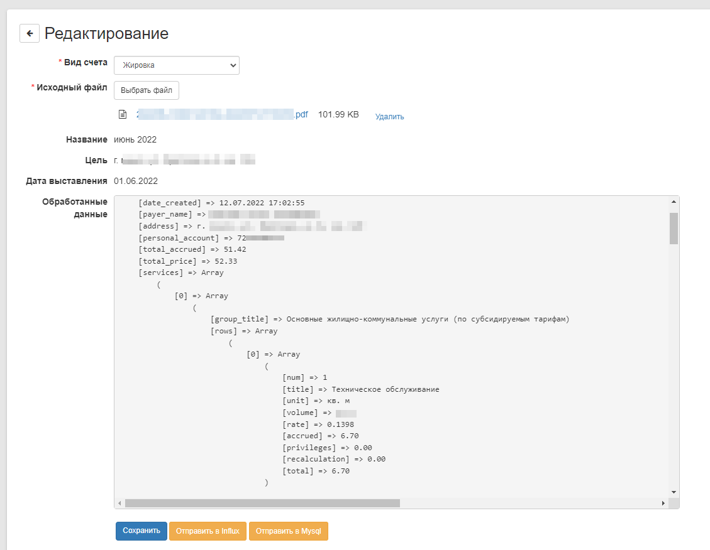

# Invoices (Жировки)

Модуль для получения данных из жировок (парсинг)\
Создан на базе фреймворка [Core2](https://github.com/easterism/core2)

## Функции

- Загрузка и парсинг PDF файлов жировок 
- Отправка результата с данными в mysql или Influx базу данных  

## Примеры

Список жировок\

Просмотр данных и отправка их в базу данных\

